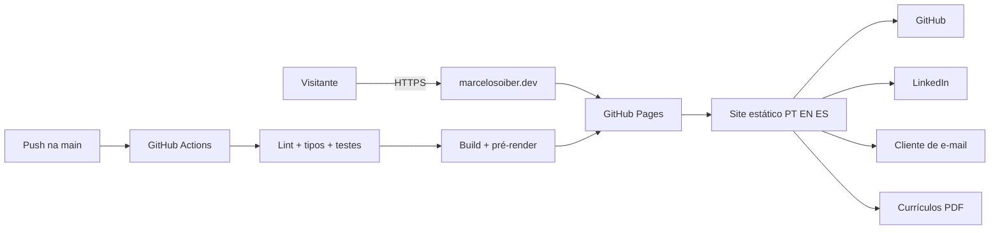
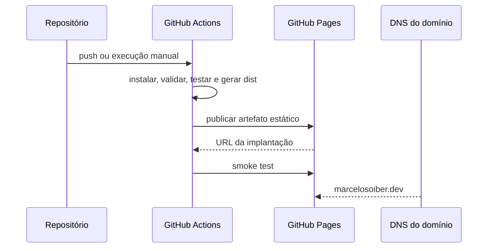

# Planejamento do portfólio — marcelosoiber.dev

- Versão: 1.0
- Data: 2026-10-03
- Status: proposto, com decisões principais aceitas
- Responsável e decisor: Marcelo Soiber
- Escopo: primeira versão pública e sua evolução imediata
- Classificação: projeto greenfield
- Confiança: alta para arquitetura e direção visual; média para conteúdo traduzido

## 1. Resumo executivo

O projeto criará um portfólio trilíngue, estático e sem backend para consolidar a autoridade técnica de Marcelo Soiber como engenheiro de software especializado em arquitetura, sistemas inteligentes e IA aplicada.

A solução será desenvolvida com Vue 3, Vite e TypeScript, pré-renderizada para português, inglês e espanhol e publicada automaticamente no GitHub Pages. O endereço principal será `https://marcelosoiber.dev`, com DNS administrado no provedor onde o domínio foi comprado e HTTPS obrigatório.

A experiência visual seguirá uma direção industrial futurista: uma interface de telemetria sofisticada, inspirada em centros de comando tecnológicos, mas com identidade própria e sem copiar marcas, telas ou elementos protegidos de terceiros. O gesto visual central será um núcleo de telemetria no hero.

O maior benefício da arquitetura é combinar uma presença visual memorável com custo operacional quase nulo. O principal compromisso é que recursos dinâmicos, como formulário próprio, autenticação ou CMS, ficam fora do MVP.

## 2. Problema, público e resultado esperado

### Declaração do problema

Para recrutadores técnicos, engenheiros, líderes e potenciais colaboradores, o site deve apresentar a experiência e o raciocínio de Marcelo por meio de estudos de caso verificáveis, respeitando baixo custo, boa performance, acessibilidade, três idiomas e ausência de backend.

### Objetivo principal

Construir autoridade técnica, e não apenas reproduzir um currículo online.

### Públicos prioritários

1. Engenheiros e arquitetos de software.
2. Líderes técnicos e gestores de engenharia.
3. Recrutadores técnicos.
4. Pessoas interessadas em IA aplicada, RAG, sistemas distribuídos e algoritmos.

### Jornada principal

1. A pessoa acessa o domínio e entende o posicionamento em poucos segundos.
2. Explora competências e projetos em destaque.
3. Abre um estudo de caso e compreende problema, decisões e trade-offs.
4. Valida o trabalho pelo código no GitHub.
5. Baixa o currículo ou inicia contato por e-mail/LinkedIn.

### Critérios de sucesso

- Posicionamento compreensível em até 10 segundos de leitura.
- Três estudos de caso completos e verificáveis.
- Conteúdo navegável em português, inglês e espanhol.
- Lighthouse igual ou superior a 90 nas quatro categorias principais em condições controladas.
- Experiência funcional com teclado, leitor de tela e movimento reduzido.
- Deploy reproduzível e automático pela branch principal.
- Domínio `marcelosoiber.dev` servido com HTTPS.

## 3. Escopo

### Dentro do MVP

- Site público e responsivo.
- Português como idioma padrão, inglês e espanhol.
- Hero com identidade digital e núcleo de telemetria.
- Perfil profissional e posicionamento.
- Mapa de competências.
- Estudos de caso de três projetos.
- Experiência, formação e reconhecimentos.
- Notas curtas de engenharia derivadas dos projetos.
- Links para GitHub, LinkedIn, e-mail e currículos.
- SEO técnico, metadados sociais e `hreflang`.
- Acessibilidade WCAG 2.2 nível AA como meta.
- Testes automatizados essenciais.
- CI/CD e GitHub Pages.
- Domínio personalizado e HTTPS.

### Fora do MVP

- Backend, banco de dados ou autenticação.
- CMS e painel administrativo.
- Comentários, newsletter ou busca interna.
- Formulário de contato próprio.
- Analytics que exija cookies ou consentimento.
- Blog completo com feed e taxonomia.
- Integração em tempo real com GitHub ou LinkedIn.
- Reprodução de interfaces, logotipos ou recursos visuais da Marvel/Homem de Ferro.

### Gatilhos de evolução

- Adotar um gerador de conteúdo estruturado quando houver pelo menos 10 artigos.
- Avaliar analytics sem cookies quando houver uma pergunta real de produto a responder.
- Adotar serviço externo de formulário apenas se o e-mail direto gerar atrito mensurável.
- Rever a hospedagem se o limite operacional do GitHub Pages se tornar restritivo.

## 4. Briefing vivo

| Estado | Item | Evidência ou valor | Impacto |
|---|---|---|---|
| Confirmado | Objetivo | Construir autoridade técnica | Conteúdo será orientado a decisões e casos reais |
| Confirmado | Posicionamento | Engenheiro de Software especializado em arquitetura, sistemas inteligentes e IA aplicada | Define headline e hierarquia editorial |
| Confirmado | Idiomas | Português, inglês e espanhol | Exige rotas estáticas, revisão e SEO localizado |
| Confirmado | Identidade | Digital, sem foto no hero | O núcleo de telemetria será o elemento central |
| Confirmado | Contato | `marcelo.soiber@gmail.com` | Exibir com proteção básica contra coleta automática |
| Confirmado | Currículo | PDF existente em `/home/marcelo-soiber/Documentos/curriculo-export/Curriculo_Marcelo_Soiber.pdf` | Fonte primária do conteúdo profissional |
| Confirmado | Domínio | `marcelosoiber.dev`, já adquirido | HTTPS é obrigatório para `.dev` |
| Confirmado | Hospedagem | GitHub Pages | Site precisa ser totalmente estático |
| Confirmado | Projetos | Knowledge Hub, Credit Card Fraud Detection e Knight's Tour | Formam os estudos de caso do MVP |
| Decidido | Stack | Vue 3 + Vite + TypeScript | Boa composição de UI com baixo custo operacional |
| Decidido | Backend | Não haverá | Contato por links externos e e-mail |
| Suposição | Tráfego inicial | Até 10 mil visitas/mês e pico de 100 visitantes simultâneos | Compatível com hospedagem estática |
| Pendente não bloqueante | Currículos traduzidos | Recomenda-se um PDF por idioma | Português pode ser publicado primeiro |
| Pendente não bloqueante | Mídia do Knowledge Hub | Não há imagem incorporada ao README principal | Criar screenshot próprio ou visual arquitetural |

## 5. Requisitos funcionais

| ID | Capacidade | Prioridade | Critério de aceite |
|---|---|---:|---|
| RF-001 | Comunicar posicionamento no hero | Alta | Nome, especialidade e proposta aparecem sem rolagem em desktop e mobile |
| RF-002 | Navegar entre seções | Alta | Navegação funciona por mouse, toque e teclado |
| RF-003 | Alternar idioma | Alta | PT, EN e ES possuem URL própria, conteúdo equivalente e preferência persistida |
| RF-004 | Explorar projetos | Alta | Cada projeto apresenta problema, arquitetura, decisões, stack, resultado e links |
| RF-005 | Validar código-fonte | Alta | Cada estudo de caso possui link correto para o repositório público |
| RF-006 | Consultar experiência e formação | Alta | Conteúdo é coerente com o currículo aprovado |
| RF-007 | Baixar currículo | Alta | Download funciona em cada idioma disponível e informa o idioma do arquivo |
| RF-008 | Entrar em contato | Alta | E-mail, LinkedIn e GitHub abrem destinos corretos |
| RF-009 | Compartilhar o site | Média | Cada idioma possui título, descrição e imagem social adequados |
| RF-010 | Consumir com movimento reduzido | Alta | A experiência permanece completa sem animações não essenciais |
| RF-011 | Ler notas de engenharia | Média | MVP apresenta notas curtas ligadas aos estudos de caso |
| RF-012 | Entender o estado do sistema visual | Baixa | Indicadores decorativos são claramente decorativos e não simulam dados reais |

## 6. Requisitos não funcionais

| ID | Atributo | Meta | Verificação | Prioridade |
|---|---|---|---|---:|
| RNF-001 | Desempenho | LCP <= 2,5 s, INP <= 200 ms e CLS <= 0,1 em perfil mobile controlado | Lighthouse e teste manual | Alta |
| RNF-002 | Qualidade | Lighthouse >= 90 em performance, acessibilidade, boas práticas e SEO | CI e auditoria final | Alta |
| RNF-003 | Acessibilidade | WCAG 2.2 AA para contraste, teclado, foco e semântica | axe, teclado e revisão manual | Alta |
| RNF-004 | Compatibilidade | Duas versões recentes de Chrome, Firefox, Edge e Safari | Matriz de testes | Alta |
| RNF-005 | Responsividade | 320 px até monitores ultrawide sem perda de conteúdo | Testes por viewport | Alta |
| RNF-006 | Peso inicial | JavaScript inicial comprimido <= 150 KB e hero <= 500 KB de mídia | Relatório de build | Média |
| RNF-007 | Privacidade | Sem cookies, trackers ou coleta de dados no MVP | Inspeção de rede | Alta |
| RNF-008 | Segurança | HTTPS obrigatório, sem secrets no bundle e dependências auditadas | CI e inspeção do artefato | Alta |
| RNF-009 | Disponibilidade | Meta aspiracional de 99,9%, limitada pelo GitHub Pages e DNS | Monitoramento externo opcional | Média |
| RNF-010 | Recuperação | RPO 0 para conteúdo versionado; RTO <= 2 h por redeploy ou rollback | Ensaio de rollback | Média |
| RNF-011 | SEO | Canonical, sitemap, robots, JSON-LD e `hreflang` válidos | Validadores e inspeção | Alta |
| RNF-012 | Manutenibilidade | Conteúdo separado de componentes e paridade entre idiomas validada | Revisão e testes | Alta |

## 7. Direção de conteúdo

### Mensagem principal

**Português**

> Engenheiro de Software especializado em arquitetura, sistemas inteligentes e IA aplicada.

**Inglês**

> Software Engineer specializing in architecture, intelligent systems, and applied AI.

**Espanhol**

> Ingeniero de Software especializado en arquitectura, sistemas inteligentes e IA aplicada.

### Tom editorial

- Técnico, direto e humano.
- Confiante sem superlativos vazios.
- Evidências antes de adjetivos.
- Explicação de decisões e trade-offs.
- Sem métricas inventadas ou afirmações não verificáveis.
- Termos técnicos traduzidos com consistência, mantendo nomes próprios de tecnologias.

### Arquitetura da informação

1. **Hero / System Identity** — nome, posicionamento, CTAs e núcleo visual.
2. **Mission Profile** — trajetória, contexto em pagamentos e forma de trabalhar.
3. **Capability Matrix** — arquitetura, desenvolvimento, dados/IA e operação.
4. **Featured Systems** — três estudos de caso.
5. **Experience Timeline** — experiência profissional e marcos.
6. **Engineering Notes** — aprendizados curtos extraídos dos projetos.
7. **Education & Recognition** — formação, maratonas e eventos.
8. **Contact Terminal** — GitHub, LinkedIn, e-mail e currículo.

### Projetos em destaque

#### 1. Knowledge Hub — estudo de caso principal

- Problema: conhecimento distribuído entre documentos, notas e fontes diferentes.
- Proposta: ingestão, organização, busca semântica e respostas fundamentadas.
- Destaques: RAG, FastAPI, Angular, PostgreSQL/pgvector, modelos locais e MCP.
- Narrativa de autoridade: privacidade, arquitetura, integração de agentes e decisões operacionais.
- Link: `https://github.com/MarceloSoiber/knowledge-hub`.

#### 2. Credit Card Fraud Detection

- Problema: priorização de transações com comportamento anômalo.
- Proposta: combinar modelos preditivos/sequenciais com IA generativa e interpretação humana.
- Narrativa de autoridade: explicabilidade, risco, apoio à decisão e limites de ML.
- Link: `https://github.com/MarceloSoiber/credit-card-fraud-detection`.

#### 3. Knight's Tour

- Problema: encontrar uma rota válida em espaço de busca restrito.
- Proposta: algoritmo genético com jobs, acompanhamento por SSE e mecanismos contra estagnação.
- Narrativa de autoridade: otimização, concorrência, progresso em tempo real e experimentação.
- Link: `https://github.com/MarceloSoiber/Knight-s-Tour`.

## 8. Direção visual

### Conceito

**HUD industrial futurista com disciplina editorial.** A interface deve parecer uma ferramenta técnica criada para leitura e análise, não uma tela cenográfica carregada.

### Assinatura visual

Um núcleo circular de telemetria no hero, composto por anéis, marcas de coordenadas, linhas orbitais e pequenos indicadores. Ele reage suavemente ao ponteiro em dispositivos compatíveis e se torna estático em movimento reduzido.

### Princípios

- Identidade própria; nenhuma cópia de interface, ícones ou nomenclatura da Marvel.
- Densidade visual contida dentro de painéis; leitura permanece limpa.
- Ciano comunica atividade; âmbar comunica destaque; vermelho é reservado a alertas reais.
- Glow usado como acento, não como fonte principal de contraste.
- Dados decorativos não devem parecer métricas reais.

### Tokens iniciais

| Token | Valor inicial | Uso |
|---|---|---|
| Fundo primário | `#05090D` | Base da página |
| Superfície | `#0B141B` | Painéis e cards |
| Superfície elevada | `#10222C` | Hover e destaques |
| Texto principal | `#EAF7FA` | Títulos e corpo |
| Texto secundário | `#89A7B3` | Metadados |
| Ciano | `#35E6F2` | Ação e foco |
| Âmbar | `#FFB84D` | Ênfase secundária |
| Perigo | `#FF5D6C` | Erros reais |
| Borda | `rgba(89, 218, 232, 0.24)` | Delimitação técnica |
| Raio | `4px`, `12px` | Painéis e controles |
| Grid base | `4px`/`8px` | Espaçamento |

### Tipografia

- Display: `Space Grotesk` ou equivalente geométrica.
- Corpo: `IBM Plex Sans`.
- Dados e labels: `JetBrains Mono`.
- Fontes hospedadas localmente em WOFF2, com `font-display: swap` e fallbacks de sistema.

### Layout

- Grid máximo de 12 colunas em desktop.
- Conteúdo com largura legível de 68–76 caracteres.
- Hero assimétrico: conteúdo à esquerda e núcleo visual à direita.
- Cards de projeto com hierarquia editorial e diagramas/screenshot, não apenas logos de stack.
- Abaixo de 900 px, grids viram coluna única e o núcleo reduz complexidade.
- Alvos de toque com no mínimo 44 × 44 px.

### Plano de movimento

1. Inicialização do hero em até 900 ms.
2. Reveal escalonado curto para conteúdo principal.
3. Linhas de varredura discretas apenas em áreas decorativas.
4. Elevação magnética limitada em cards/CTAs para dispositivos com ponteiro fino.
5. Intersection Observer para ativar animações uma vez.
6. `prefers-reduced-motion: reduce` remove paralaxe, órbitas e deslocamentos.
7. Nenhuma informação dependerá de hover ou animação.

## 9. Opções arquiteturais consideradas

| Opção | Pontos fortes | Limitações | Adequação |
|---|---|---|---|
| HTML/CSS/JS | Menor complexidade e bundle | Manutenção de três idiomas e componentes interativos fica mais manual | Boa, mas não escolhida |
| Vue 3 + Vite | Componentização, excelente ergonomia e build estático | Requer pipeline e controle de bundle | **Recomendada** |
| Astro com ilhas Vue | Ótimo HTML estático e SEO | Adiciona outro framework e modelo mental | Alternativa futura |
| Nuxt em modo estático | Rotas, SEO e geração estática integrados | Complexidade maior que a necessária no MVP | Não escolhido |

### Por que Vue vence

- O site possui componentes visuais e interações suficientes para justificar componentização.
- A equipe já trabalha com ecossistemas frontend modernos.
- Vite entrega build estático compatível com GitHub Pages.
- TypeScript ajuda a manter a paridade do conteúdo trilíngue.
- A complexidade continua controlada sem Pinia, backend ou SSR em runtime.

### Gatilho de revisão

Reavaliar Astro/Nuxt quando o site superar 10 artigos, exigir geração editorial frequente ou apresentar dificuldade mensurável de SEO/pré-renderização.

## 10. Arquitetura recomendada

### Estilo

Aplicação frontend estática, componentizada e orientada a conteúdo, com pré-renderização durante o build. Não haverá servidor de aplicação em produção.



### Fluxo de publicação



### Internacionalização e URLs

- Português: `/`
- Inglês: `/en/`
- Espanhol: `/es/`
- O build gera HTML acessível diretamente para cada rota.
- A preferência de idioma pode ser persistida, mas não redirecionará silenciosamente usuários ou robôs.
- Cada rota terá `lang`, `canonical`, `hreflang`, metadados sociais e conteúdo equivalente.
- Chaves de conteúdo terão tipos compartilhados e teste de paridade.

## 11. Componentes e responsabilidades

| Componente | Responsabilidade | Dependências | Falha/degradação |
|---|---|---|---|
| App shell | Estrutura semântica, navegação e idioma | Vue | Conteúdo básico permanece renderizado |
| HeroSystem | Headline, CTAs e núcleo de telemetria | CSS/Canvas opcional | Núcleo vira arte estática |
| CapabilityMatrix | Apresentar competências por domínio | Conteúdo localizado | Lista simples como fallback |
| ProjectCaseStudy | Exibir estudos de caso | Conteúdo e mídia local | Texto e links permanecem |
| ExperienceTimeline | Experiência e formação | Conteúdo localizado | Fluxo vertical simples |
| EngineeringNotes | Notas curtas de autoridade | Conteúdo localizado | Pode ser omitido sem afetar o fluxo principal |
| LanguageSwitcher | Trocar rota/idioma | Mapa de rotas | Português como fallback |
| ContactTerminal | Links e download | URLs externas e PDFs | Links mostram endereço/destino |
| SEOHead | Metadados por idioma | Manifesto de conteúdo | Defaults seguros |

## 12. Estrutura prevista do projeto

```text
.
├── .github/
│   └── workflows/
│       └── deploy-pages.yml
├── docs/
│   ├── planejamento-portfolio.md
│   └── tarefas.md
├── public/
│   ├── cv/
│   ├── fonts/
│   ├── images/
│   ├── favicon.svg
│   ├── robots.txt
│   └── site.webmanifest
├── src/
│   ├── assets/
│   ├── components/
│   │   ├── hud/
│   │   ├── layout/
│   │   ├── projects/
│   │   └── ui/
│   ├── composables/
│   ├── content/
│   │   ├── en/
│   │   ├── es/
│   │   ├── pt/
│   │   └── schema.ts
│   ├── sections/
│   ├── styles/
│   ├── App.vue
│   └── main.ts
├── tests/
│   ├── e2e/
│   └── unit/
├── index.html
├── package.json
├── tsconfig.json
└── vite.config.ts
```

## 13. Dados, APIs e integrações

### Dados

- Não existe banco de dados.
- Arquivos TypeScript/JSON tipados são a fonte de verdade do conteúdo.
- Git é o histórico e mecanismo de recuperação.
- Mídia e currículos são artefatos versionados e otimizados.

### APIs

Não necessário no MVP. O site não executa chamadas de API em runtime.

### Integrações externas

| Integração | Uso | Comportamento em falha |
|---|---|---|
| GitHub | Código e perfil | Link permanece visível; falha não afeta o site |
| LinkedIn | Perfil profissional | Link permanece visível; falha não afeta o site |
| E-mail | Contato | Endereço pode ser copiado manualmente |
| GitHub Pages | Hospedagem | Recuperar por redeploy ou aguardar serviço |
| DNS/registrador | Domínio | Fallback técnico continua no domínio `github.io` |

## 14. Segurança e privacidade

### Limites de confiança

- Código e conteúdo versionados são confiáveis após revisão.
- Dependências npm e GitHub Actions são externas.
- GitHub, LinkedIn e cliente de e-mail são destinos externos.
- Não haverá entrada de dados do visitante no MVP.

### Ameaças prioritárias

| ID | Cenário | Impacto | Controle | Residual |
|---|---|---|---|---|
| SEC-001 | Dependência comprometida injeta código | Alto | lockfile, `npm ci`, auditoria, poucas dependências e Actions fixadas | Baixo/médio |
| SEC-002 | Secret incluído no bundle/repositório | Alto | nenhum secret necessário, scan no CI e revisão do `dist` | Baixo |
| SEC-003 | Sequestro do domínio Pages | Alto | verificar domínio no GitHub, manter TXT e bloquear transferência | Baixo |
| SEC-004 | Conteúdo traduzido injeta HTML | Médio | evitar `v-html`; conteúdo tratado como texto/componentes | Baixo |
| SEC-005 | Coleta automática do e-mail | Baixo | composição no cliente e link acessível | Médio |
| SEC-006 | Tabnabbing em links externos | Baixo | `rel="noopener noreferrer"` | Baixo |
| SEC-007 | Assets externos indisponíveis/rastreiam visitante | Médio | hospedar fontes e mídia localmente | Baixo |

### Privacidade

- Nenhum cookie ou identificador no MVP.
- Nenhum formulário ou dado pessoal coletado.
- O único dado pessoal publicado será o conteúdo profissional aprovado e o e-mail informado.
- Se analytics for adicionado, deverá ser privacy-first e passar por revisão de necessidade e consentimento.

## 15. Desempenho, resiliência e operação

### Estratégia de desempenho

- Pré-renderizar HTML por idioma.
- Usar SVG/CSS para elementos técnicos sempre que possível.
- Adiar Canvas e mídia fora da viewport.
- Gerar AVIF/WebP com dimensões explícitas.
- Carregar no máximo duas famílias principais no primeiro viewport.
- Dividir código apenas quando a medição justificar.
- Evitar biblioteca de animação no MVP; preferir CSS e Web Animations API.

### Resiliência

- Links externos não bloqueiam renderização.
- O site funciona sem JavaScript para o conteúdo pré-renderizado essencial.
- Falhas de animação degradam para estado estático.
- Rollback é feito redeployando um commit anterior.
- RPO 0 para conteúdo commitado; RTO alvo de 2 horas.

### Observabilidade proporcional

- Histórico e logs do GitHub Actions.
- Smoke test pós-deploy das rotas `/`, `/en/` e `/es/`.
- Verificação automática de links internos e assets.
- Lighthouse CI ou auditoria equivalente antes do lançamento.
- Monitor externo é opcional após publicação; não é bloqueante.

## 16. Testes e verificações

| Camada | Cobertura planejada |
|---|---|
| Estática | TypeScript, ESLint e formatação |
| Unidade | Utilitários de idioma, construção de links e validação do schema |
| Conteúdo | Paridade de chaves PT/EN/ES e URLs obrigatórias |
| Componentes | Estados críticos do seletor de idioma e navegação |
| E2E | Hero, navegação, troca de idioma, links e downloads |
| Acessibilidade | axe automatizado mais revisão manual de teclado e leitor de tela |
| Visual | Viewports representativos e movimento reduzido |
| Performance | Lighthouse mobile/desktop e análise do bundle |
| Deploy | Build limpo, rotas diretas e smoke test HTTPS |

## 17. CI/CD, ambientes e publicação

### Ambientes

- Local: Vite dev server.
- Preview: build local ou artefato de pull request, quando necessário.
- Produção: GitHub Pages em `marcelosoiber.dev`.

### Pipeline

1. Checkout com action fixada por versão/SHA.
2. Configuração de Node LTS.
3. `npm ci`.
4. Lint, type check e testes.
5. Build e pré-renderização.
6. Auditoria de rotas/assets.
7. Upload do diretório `dist`.
8. Deploy no ambiente `github-pages`.
9. Smoke test das três rotas.

### DNS e TLS

1. Criar o site no GitHub Pages antes de apontar DNS.
2. Adicionar e verificar `marcelosoiber.dev` no perfil GitHub Pages com TXT.
3. Configurar domínio apex com registros aceitos pelo GitHub Pages.
4. Configurar `www` como CNAME e redirecionar para o apex.
5. Manter o registro TXT de verificação.
6. Aguardar o certificado e ativar `Enforce HTTPS`.
7. Usar modo DNS-only inicialmente se o DNS estiver na Cloudflare; avaliar proxy somente depois do certificado estável.

## 18. SEO e presença internacional

- Título e descrição únicos por idioma.
- `canonical` autorreferente por rota.
- `hreflang` para `pt-BR`, `en` e `es`, além de `x-default`.
- `sitemap.xml` com as três variantes.
- `robots.txt` permitindo indexação.
- JSON-LD do tipo `Person`, apenas com informações públicas confirmadas.
- Open Graph e Twitter Cards com imagem própria.
- Favicon e manifesto coerentes com a identidade visual.
- Conteúdo principal presente no HTML pré-renderizado.
- Não redirecionar robôs com base em idioma do navegador.

## 19. Custos

| Item | Custo esperado |
|---|---:|
| Domínio `marcelosoiber.dev` | Já adquirido; renovação conforme registrador |
| GitHub Pages | Sem custo no escopo atual |
| GitHub Actions | Dentro da franquia esperada para projeto público |
| Fontes | Sem custo, respeitando licenças |
| Backend/banco | Não aplicável |
| Operação | Tempo de manutenção e revisão de conteúdo |

Os maiores direcionadores de custo são a renovação do domínio e o tempo humano de manter traduções e estudos de caso.

## 20. Decisões arquiteturais

### ADR-001 — Vue 3, Vite e TypeScript

- Status: aceito.
- Decisão: usar Vue 3 com Vite e TypeScript, sem Pinia ou framework SSR no MVP.
- Consequência: componentes e conteúdo tipado com build obrigatório.
- Revisar quando: conteúdo editorial crescer ou SEO exigir outra estratégia comprovada por métricas.

### ADR-002 — Hospedagem estática no GitHub Pages

- Status: aceito.
- Decisão: gerar `dist` e publicar com GitHub Actions.
- Consequência: custo baixo, sem backend e com dependência do GitHub.
- Revisar quando: limites, previews ou requisitos de headers se tornarem impeditivos.

### ADR-003 — Três rotas pré-renderizadas

- Status: aceito.
- Decisão: português em `/`, inglês em `/en/` e espanhol em `/es/`.
- Consequência: melhor indexação e links diretos, com custo editorial triplicado.
- Revisar quando: número de páginas tornar a manutenção manual impraticável.

### ADR-004 — Contato sem formulário

- Status: aceito.
- Decisão: usar e-mail, LinkedIn e GitHub.
- Consequência: nenhum dado coletado e nenhuma operação de backend.
- Revisar quando: houver evidência de perda de contatos relevantes.

### ADR-005 — Movimento progressivo e acessível

- Status: aceito.
- Decisão: CSS/Web Animations como padrão; Canvas somente se medição aprovar.
- Consequência: estética forte com degradação segura.
- Revisar quando: a direção visual não puder ser atingida dentro do orçamento de performance.

### ADR-006 — Identidade futurista original

- Status: aceito.
- Decisão: evocar tecnologia avançada sem copiar propriedades visuais da Marvel.
- Consequência: menor risco autoral e marca pessoal mais durável.

## 21. Riscos e mitigação

| ID | Risco | Prob. | Impacto | Nível | Mitigação |
|---|---|---:|---:|---:|---|
| RISCO-001 | Excesso de animações prejudicar performance | Média | Alto | Alto | Orçamento de bundle, movimento progressivo e testes mobile |
| RISCO-002 | Visual comprometer legibilidade | Média | Alto | Alto | Contraste AA, grid editorial e testes de leitura |
| RISCO-003 | Traduções inconsistentes | Média | Médio | Médio | Glossário, schema tipado e revisão humana |
| RISCO-004 | Conteúdo parecer apenas uma lista de stacks | Média | Alto | Alto | Formato obrigatório de estudo de caso e evidências |
| RISCO-005 | Mídia dos projetos ter baixa qualidade | Média | Médio | Médio | Recriar screenshots em viewport controlado |
| RISCO-006 | Configuração DNS/TLS causar indisponibilidade | Baixa | Alto | Médio | Ordem segura, fallback `github.io` e checklist de DNS |
| RISCO-007 | Currículo expor informações desatualizadas | Média | Médio | Médio | Revisão antes da cópia e data de atualização |
| RISCO-008 | Dependências aumentarem sem necessidade | Média | Médio | Médio | Aprovação explícita e auditoria de bundle |

## 22. Roadmap

### Fase 0 — Conteúdo e evidências

- Revisar currículo e textos-base.
- Escrever os três estudos de caso.
- Extrair/produzir screenshots.
- Definir política dos currículos traduzidos.

**Pronto quando:** todo conteúdo do MVP está aprovado em português e possui fontes verificáveis.

### Fase 1 — Fundação

- Inicializar Vue/Vite/TypeScript.
- Configurar qualidade, testes e estrutura.
- Definir tokens, fontes e shell responsivo.

**Pronto quando:** build reproduzível e página base acessível funcionam localmente.

### Fase 2 — Fatia vertical

- Implementar hero, navegação, um estudo de caso e contato em português.
- Validar estética, responsividade, movimento e performance.

**Pronto quando:** o fluxo principal funciona do hero ao contato.

### Fase 3 — Conteúdo completo

- Implementar demais seções e estudos de caso.
- Otimizar imagens e currículos.
- Adicionar notas de engenharia.

**Pronto quando:** a versão portuguesa está completa.

### Fase 4 — Internacionalização e SEO

- Traduzir e revisar EN/ES.
- Pré-renderizar rotas.
- Adicionar metadados, sitemap, JSON-LD e `hreflang`.

**Pronto quando:** as três versões possuem paridade e URLs diretas válidas.

### Fase 5 — Qualidade e publicação

- Executar matriz de testes.
- Configurar Actions e Pages.
- Configurar domínio, DNS e HTTPS.
- Fazer smoke test e registrar baseline Lighthouse.

**Pronto quando:** `marcelosoiber.dev` está público, seguro e validado.

### Fase 6 — Evolução por evidência

- Observar feedback e links mais úteis.
- Publicar novas notas técnicas.
- Rever analytics somente com hipótese definida.

## 23. Portão de qualidade

| Área | Estado | Observação |
|---|---|---|
| Problema, público e objetivo | Atendido | Autoridade técnica claramente definida |
| Escopo e fluxo principal | Atendido | MVP e exclusões explícitos |
| Requisitos funcionais e não funcionais | Atendido | Metas e verificações definidas |
| Dados e privacidade | Atendido | Sem coleta; conteúdo versionado |
| Arquitetura e alternativas | Atendido | Vue/Vite comparado a opções plausíveis |
| Segurança | Atendido | Modelo proporcional ao risco estático |
| Operação e recuperação | Atendido | CI, rollback e fallback documentados |
| Custos | Atendido | Custos diretos e humanos identificados |
| Currículos EN/ES | Pendente não bloqueante | Pode entrar durante a fase de internacionalização |
| Screenshot do Knowledge Hub | Pendente não bloqueante | Pode ser produzido na fase de conteúdo |

## 24. Prontidão e próximos passos

- [x] Objetivo e posicionamento confirmados.
- [x] Stack e hospedagem definidas.
- [x] Domínio comprado.
- [x] Três idiomas definidos.
- [x] Projetos prioritários definidos.
- [x] Identidade digital sem foto definida.
- [x] Contato e currículo identificados.
- [ ] Aprovar os textos completos em português.
- [ ] Decidir e produzir currículos EN/ES.
- [ ] Produzir mídia do Knowledge Hub.
- [ ] Executar o backlog de `docs/tarefas.md`.

