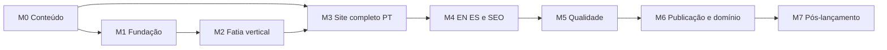

# Backlog de desenvolvimento — marcelosoiber.dev

- Versão: 1.0
- Data: 2026-10-03
- Fonte arquitetural: `docs/planejamento-portfolio.md`
- Estado atual: MVP implementado localmente; publicação pendente

## Progresso da implementação — 2026-10-03

Concluído nesta primeira entrega:

- fundação Vue 3, Vite, TypeScript e geração estática com `vite-ssg`;
- rotas e conteúdo em português, inglês e espanhol;
- direção visual HUD tecnológico responsiva, com movimento reduzido;
- perfil, competências, três estudos de caso, experiência, notas e contato;
- currículo em português, ilustrações dos projetos e card social;
- metadados SEO, JSON-LD, sitemap, robots e manifesto;
- ESLint, TypeScript, Vitest e build de produção validados;
- workflow de qualidade e publicação no GitHub Pages preparado.

Pendente antes da publicação definitiva:

- revisão factual e editorial de Marcelo nos três idiomas;
- substituir ou complementar as ilustrações com screenshots dos projetos, se desejado;
- decidir e produzir currículos em inglês e espanhol;
- executar auditoria Lighthouse e smoke test em navegador real;
- enviar o código ao GitHub, ativar Pages e configurar o DNS de `marcelosoiber.dev`.

## 1. Como usar este documento

- Marcar uma tarefa como concluída somente quando seus critérios de aceite forem atendidos.
- Não iniciar uma tarefa bloqueada antes de suas dependências.
- Prioridades: `P0` bloqueia o lançamento, `P1` é importante para o MVP, `P2` pode ser adiada.
- Tarefas técnicas não devem inventar conteúdo profissional; fatos precisam de fonte ou aprovação.
- Alterações de stack, hospedagem, idiomas ou coleta de dados exigem atualização do planejamento e um novo ADR.

## 2. Definição de pronto global

Uma entrega está pronta quando:

- código e conteúdo passaram por revisão;
- lint, type check, testes e build estão verdes;
- teclado, foco, contraste e movimento reduzido foram verificados;
- desktop e mobile foram testados;
- não há secrets, trackers ou chamadas inesperadas;
- documentação relacionada foi atualizada;
- o critério de aceite específico foi demonstrado.

## 3. Marcos e dependências

## M0 — Conteúdo, evidências e ativos

Objetivo: preparar conteúdo verificável antes de multiplicá-lo em três idiomas.

### T-001 — Consolidar perfil profissional

- Prioridade: P0
- Dependências: nenhuma
- [ ] Extrair do currículo nome, headline, resumo, experiência, formação e reconhecimentos.
- [ ] Conferir informações públicas do LinkedIn e GitHub.
- [ ] Remover ou sinalizar qualquer afirmação sem evidência.
- [ ] Aprovar o texto-base em português.

**Aceite:** existe uma fonte de conteúdo em português revisada por Marcelo.

### T-002 — Escrever estudo de caso do Knowledge Hub

- Prioridade: P0
- Dependências: T-001
- [ ] Descrever problema e público.
- [ ] Documentar arquitetura RAG, Angular, FastAPI, PostgreSQL/pgvector, modelos locais e MCP.
- [ ] Explicar decisões, alternativas, privacidade e operação.
- [ ] Selecionar links relevantes do repositório.
- [ ] Revisar para não expor endereços ou configurações de ambientes privados.

**Aceite:** o estudo de caso contém contexto, decisão, trade-off, resultado e evidência.

### T-003 — Escrever estudo de caso de fraude

- Prioridade: P0
- Dependências: T-001
- [ ] Explicar o cenário simulado e deixar claro que é um laboratório.
- [ ] Descrever modelos, sinais, explicabilidade e apoio humano.
- [ ] Evitar alegações de performance sem métrica reproduzível.
- [ ] Selecionar links e screenshots.

**Aceite:** o texto diferencia claramente estudo aplicado de sistema financeiro em produção.

### T-004 — Escrever estudo de caso do Knight's Tour

- Prioridade: P0
- Dependências: T-001
- [ ] Explicar o problema e o espaço de busca.
- [ ] Descrever algoritmo genético, mutações, Warnsdorff e recuperação de estagnação.
- [ ] Documentar jobs, SSE, interface e persistência.
- [ ] Selecionar link e screenshot.

**Aceite:** o estudo demonstra raciocínio algorítmico e engenharia da solução.

### T-005 — Preparar mídia dos projetos

- Prioridade: P0
- Dependências: T-002, T-003, T-004
- [ ] Baixar as duas imagens do README de Fraud Detection.
- [ ] Baixar a imagem do README de Knight's Tour.
- [ ] Produzir screenshot limpo do Knowledge Hub ou visual de arquitetura aprovado.
- [ ] Recortar em proporções consistentes.
- [ ] Gerar AVIF/WebP e fallback quando necessário.
- [ ] Escrever textos alternativos nos três idiomas.

**Aceite:** cada projeto possui ao menos uma imagem nítida, otimizada e licenciada para uso.

### T-006 — Preparar currículos

- Prioridade: P1
- Dependências: T-001
- [ ] Copiar o PDF português para `public/cv/` com nome estável.
- [ ] Decidir se EN e ES entram no primeiro lançamento.
- [ ] Produzir e revisar PDFs traduzidos, se aprovados.
- [ ] Remover metadados desnecessários dos PDFs.
- [ ] Validar tamanho, seleção de texto e links.

**Aceite:** todo botão de currículo aponta para um arquivo existente e identifica seu idioma.

### T-007 — Criar glossário de tradução

- Prioridade: P1
- Dependências: T-001
- [ ] Definir traduções de cargos, arquitetura, IA aplicada e termos dos projetos.
- [ ] Registrar termos que permanecem em inglês.
- [ ] Padronizar capitalização e tom.

**Aceite:** traduções usam vocabulário consistente entre seções.

## M1 — Fundação técnica

Objetivo: obter um build mínimo, tipado, testável e publicável.

### T-101 — Inicializar o repositório e Vue

- Prioridade: P0
- Dependências: nenhuma
- [ ] Inicializar Git sem apagar arquivos existentes.
- [ ] Criar projeto Vue 3 + Vite + TypeScript no diretório atual.
- [ ] Preservar a pasta `docs/`.
- [ ] Criar `.gitignore` apropriado.
- [ ] Definir scripts `dev`, `build`, `preview`, `lint`, `typecheck` e `test`.

**Aceite:** instalação limpa seguida de build produz `dist` sem erro.

### T-102 — Configurar qualidade

- Prioridade: P0
- Dependências: T-101
- [ ] Configurar ESLint e formatação.
- [ ] Configurar Vitest.
- [ ] Configurar Playwright ou equivalente para smoke tests.
- [ ] Impedir commit acidental de `.env`, `dist` e arquivos temporários.

**Aceite:** scripts de qualidade falham diante de erro intencional e passam no estado correto.

### T-103 — Criar schema de conteúdo

- Prioridade: P0
- Dependências: T-101
- [ ] Tipar perfil, competências, projetos, experiência, notas e contato.
- [ ] Criar arquivos PT, EN e ES com a mesma estrutura.
- [ ] Implementar validação de chaves e links obrigatórios.
- [ ] Definir fallback explícito para português apenas em desenvolvimento.

**Aceite:** ausência de campo obrigatório ou tradução quebra o teste/build.

### T-104 — Configurar rotas estáticas e pré-renderização

- Prioridade: P0
- Dependências: T-101, T-103
- [ ] Gerar `/`, `/en/` e `/es/` no build.
- [ ] Garantir acesso direto e refresh no GitHub Pages.
- [ ] Definir `lang` correto em cada documento.
- [ ] Manter bundle compartilhado.

**Aceite:** as três URLs funcionam servindo apenas o conteúdo de `dist`.

### T-105 — Instalar fontes locais e tokens

- Prioridade: P1
- Dependências: T-101
- [ ] Validar licença de Space Grotesk, IBM Plex Sans e JetBrains Mono.
- [ ] Adicionar somente pesos necessários em WOFF2.
- [ ] Criar tokens de cor, tipografia, espaçamento, borda, sombra e movimento.
- [ ] Definir fallbacks e `font-display: swap`.

**Aceite:** fontes carregam localmente, sem chamadas a Google Fonts ou outro CDN.

## M2 — Fatia vertical de design e interação

Objetivo: validar a experiência completa em português antes de construir todas as seções.

### T-201 — Implementar shell semântico

- Prioridade: P0
- Dependências: T-103, T-105
- [ ] Criar skip link, header, main e footer.
- [ ] Implementar navegação responsiva e estados de foco.
- [ ] Garantir um único `h1`.
- [ ] Definir landmarks e ordem lógica de tabulação.

**Aceite:** toda navegação principal funciona somente com teclado.

### T-202 — Implementar hero e núcleo de telemetria

- Prioridade: P0
- Dependências: T-201
- [ ] Montar headline, supporting copy e CTAs.
- [ ] Criar núcleo com SVG/CSS primeiro.
- [ ] Adicionar resposta sutil ao ponteiro somente onde suportado.
- [ ] Criar estado estático para movimento reduzido.
- [ ] Impedir que o elemento decorativo seja anunciado pelo leitor de tela.

**Aceite:** hero é reconhecível, legível e mantém RNF-001 em mobile.

### T-203 — Implementar um estudo de caso vertical

- Prioridade: P0
- Dependências: T-002, T-201
- [ ] Construir card/resumo do Knowledge Hub.
- [ ] Construir apresentação detalhada do caso.
- [ ] Exibir problema, arquitetura, trade-offs, stack e link.
- [ ] Integrar mídia otimizada.

**Aceite:** visitante navega do hero ao código do projeto sem conteúdo provisório.

### T-204 — Implementar terminal de contato

- Prioridade: P0
- Dependências: T-201
- [ ] Adicionar GitHub, LinkedIn e e-mail.
- [ ] Compor o endereço de e-mail no cliente sem prejudicar acessibilidade.
- [ ] Adicionar download de currículo.
- [ ] Usar `noopener noreferrer` em novas abas.

**Aceite:** todos os destinos foram testados e o e-mail pode ser copiado.

### T-205 — Validar a direção visual

- Prioridade: P0
- Dependências: T-202, T-203, T-204
- [ ] Revisar desktop, tablet e mobile.
- [ ] Medir contraste e legibilidade.
- [ ] Testar movimento reduzido.
- [ ] Rodar Lighthouse preliminar.
- [ ] Registrar ajustes antes de replicar componentes.

**Aceite:** direção visual aprovada sem risco alto de performance ou acessibilidade.

## M3 — Site completo em português

Objetivo: completar o conteúdo e fluxo principal no idioma-base.

### T-301 — Implementar Mission Profile

- Prioridade: P1
- Dependências: T-201, T-001
- [ ] Apresentar resumo profissional e contexto de pagamentos.
- [ ] Incluir indicadores apenas quando verificáveis.
- [ ] Manter largura de leitura controlada.

**Aceite:** o texto explica trajetória e diferenciais sem repetir o hero.

### T-302 — Implementar Capability Matrix

- Prioridade: P1
- Dependências: T-201, T-001
- [ ] Agrupar arquitetura, desenvolvimento, dados/IA e operação.
- [ ] Evitar nuvem de logos sem contexto.
- [ ] Relacionar competências a projetos demonstráveis.

**Aceite:** cada grupo possui evidência ou aplicação concreta.

### T-303 — Completar projetos em destaque

- Prioridade: P0
- Dependências: T-003, T-004, T-005, T-203
- [ ] Adicionar Fraud Detection.
- [ ] Adicionar Knight's Tour.
- [ ] Padronizar hierarquia, mídia, tags e links.
- [ ] Validar alt text e comportamento sem imagem.

**Aceite:** três casos completos, distintos e verificáveis.

### T-304 — Implementar timeline

- Prioridade: P1
- Dependências: T-001
- [ ] Apresentar experiência profissional.
- [ ] Apresentar formação e reconhecimentos.
- [ ] Adaptar timeline para lista vertical no mobile.

**Aceite:** sequência cronológica é clara e acessível.

### T-305 — Implementar Engineering Notes

- Prioridade: P1
- Dependências: T-002, T-003, T-004
- [ ] Criar pelo menos três notas curtas, uma por projeto.
- [ ] Ligar cada nota ao estudo de caso correspondente.
- [ ] Evitar criar sistema de blog no MVP.

**Aceite:** notas acrescentam raciocínio técnico, não repetem descrições.

### T-306 — Finalizar navegação e rodapé

- Prioridade: P1
- Dependências: T-301 a T-305
- [ ] Atualizar navegação para todas as seções.
- [ ] Implementar estado ativo sem depender somente de cor.
- [ ] Adicionar copyright, links e data de atualização.

**Aceite:** todas as seções são alcançáveis e possuem links estáveis.

## M4 — Internacionalização e SEO

Objetivo: publicar conteúdo equivalente e indexável nos três idiomas.

### T-401 — Traduzir para inglês

- Prioridade: P0
- Dependências: M3, T-007
- [ ] Traduzir interface, perfil, projetos, notas e metadados.
- [ ] Revisar fluidez e termos técnicos.
- [ ] Evitar tradução literal de cargos quando houver termo profissional consagrado.

**Aceite:** paridade de conteúdo passa e não há strings portuguesas acidentais.

### T-402 — Traduzir para espanhol

- Prioridade: P0
- Dependências: M3, T-007
- [ ] Traduzir interface, perfil, projetos, notas e metadados.
- [ ] Revisar falsos cognatos e consistência regional neutra.

**Aceite:** paridade de conteúdo passa e não há strings portuguesas acidentais.

### T-403 — Implementar seletor de idioma

- Prioridade: P0
- Dependências: T-104, T-401, T-402
- [ ] Trocar entre páginas equivalentes.
- [ ] Informar idioma atual semanticamente.
- [ ] Persistir preferência sem redirecionamento forçado.
- [ ] Funcionar com teclado e leitor de tela.

**Aceite:** troca preserva a seção quando possível e nunca gera 404.

### T-404 — Implementar SEO técnico

- Prioridade: P0
- Dependências: T-104, T-401, T-402
- [ ] Adicionar title e description por idioma.
- [ ] Adicionar canonical e `hreflang`.
- [ ] Gerar sitemap e robots.
- [ ] Adicionar JSON-LD `Person` com dados confirmados.
- [ ] Criar favicon, manifest e imagem social.

**Aceite:** validadores reconhecem as três versões e nenhuma URL aponta para ambiente local.

### T-405 — Revisar PDFs por idioma

- Prioridade: P1
- Dependências: T-006, T-401, T-402
- [ ] Associar PDF correto a cada versão.
- [ ] Se um idioma não tiver PDF, informar explicitamente que o arquivo está em português.

**Aceite:** nenhum download é enganoso ou quebrado.

## M5 — Qualidade, segurança e desempenho

Objetivo: cumprir os requisitos não funcionais antes da publicação.

### T-501 — Automatizar testes de conteúdo

- Prioridade: P0
- Dependências: M4
- [ ] Testar schema e paridade de idiomas.
- [ ] Validar URLs obrigatórias.
- [ ] Validar existência de imagens e PDFs.
- [ ] Verificar links internos.

**Aceite:** erros de conteúdo bloqueiam CI.

### T-502 — Criar E2E essencial

- Prioridade: P0
- Dependências: M4
- [ ] Testar as três rotas diretas.
- [ ] Testar navegação principal.
- [ ] Testar seletor de idioma.
- [ ] Testar links e downloads.
- [ ] Testar movimento reduzido.

**Aceite:** suíte passa contra build de produção servido localmente.

### T-503 — Auditoria de acessibilidade

- Prioridade: P0
- Dependências: T-502
- [ ] Executar axe ou equivalente.
- [ ] Testar somente com teclado.
- [ ] Verificar zoom 200% e reflow.
- [ ] Verificar contraste e foco.
- [ ] Fazer smoke test com leitor de tela.

**Aceite:** não há violação crítica/séria conhecida e exceções estão documentadas.

### T-504 — Auditoria de performance

- Prioridade: P0
- Dependências: M4
- [ ] Medir LCP, CLS, INP e peso do bundle.
- [ ] Otimizar hero, fontes e imagens.
- [ ] Remover dependências sem valor mensurável.
- [ ] Testar aparelho/CPU modestos.

**Aceite:** RNF-001, RNF-002 e RNF-006 são atendidos ou uma exceção é aceita explicitamente.

### T-505 — Auditoria de segurança e privacidade

- Prioridade: P0
- Dependências: M4
- [ ] Rodar auditoria de dependências.
- [ ] Procurar secrets e URLs privadas.
- [ ] Inspecionar rede em runtime.
- [ ] Verificar `rel` de links externos.
- [ ] Confirmar ausência de cookies e trackers.

**Aceite:** nenhum secret, tracker ou vulnerabilidade crítica conhecida é publicado.

### T-506 — Matriz de navegadores e viewports

- Prioridade: P1
- Dependências: T-503, T-504
- [ ] Chrome/Chromium recente.
- [ ] Firefox recente.
- [ ] Safari recente ou ambiente equivalente disponível.
- [ ] Mobile 320, 375 e 430 px.
- [ ] Tablet e desktop.
- [ ] Ultrawide sem esticar conteúdo de leitura.

**Aceite:** problemas conhecidos têm correção ou degradação documentada.

## M6 — CI/CD, GitHub Pages e domínio

Objetivo: publicar com rollback simples e domínio seguro.

### T-601 — Criar workflow de CI

- Prioridade: P0
- Dependências: M5
- [ ] Executar instalação reproduzível.
- [ ] Rodar lint, tipos, testes e build.
- [ ] Usar permissões mínimas.
- [ ] Fixar Actions em versões/SHAs confiáveis.

**Aceite:** pull request quebrado não pode produzir artefato de produção válido.

### T-602 — Criar workflow do GitHub Pages

- Prioridade: P0
- Dependências: T-601
- [ ] Fazer upload apenas de `dist`.
- [ ] Usar environment `github-pages`.
- [ ] Evitar deploys concorrentes.
- [ ] Permitir execução manual.

**Aceite:** push na branch principal publica o commit correto.

### T-603 — Criar ou configurar repositório remoto

- Prioridade: P0
- Dependências: T-601
- [ ] Definir nome do repositório, preferencialmente `MarceloSoiber.github.io`.
- [ ] Configurar branch principal.
- [ ] Habilitar Pages via GitHub Actions.
- [ ] Proteger a branch conforme a capacidade da conta.

**Aceite:** URL `marcelosoiber.github.io` serve a versão publicada.

### T-604 — Verificar domínio no GitHub

- Prioridade: P0
- Dependências: T-603
- [ ] Adicionar `marcelosoiber.dev` nas configurações do perfil GitHub Pages.
- [ ] Criar registro TXT fornecido pelo GitHub.
- [ ] Confirmar verificação.
- [ ] Manter TXT após a validação.

**Aceite:** GitHub mostra o domínio como verificado para `MarceloSoiber`.

### T-605 — Configurar DNS e HTTPS

- Prioridade: P0
- Dependências: T-602, T-604
- [ ] Adicionar domínio customizado ao site antes do apontamento.
- [ ] Configurar registros apex conforme documentação atual do GitHub.
- [ ] Configurar `www` com CNAME para `MarceloSoiber.github.io`.
- [ ] Usar DNS-only durante provisionamento do certificado, se aplicável.
- [ ] Aguardar propagação e certificado.
- [ ] Ativar `Enforce HTTPS`.
- [ ] Confirmar redirecionamento `www` para apex.

**Aceite:** `https://marcelosoiber.dev` abre sem alerta e HTTP redireciona para HTTPS.

### T-606 — Smoke test e rollback

- Prioridade: P0
- Dependências: T-605
- [ ] Testar `/`, `/en/` e `/es/` pelo domínio final.
- [ ] Testar assets, PDFs, sitemap e imagem social.
- [ ] Registrar baseline Lighthouse.
- [ ] Ensaiar redeploy de um commit conhecido ou documentar o procedimento.

**Aceite:** checklist de produção está verde e rollback pode ser executado em até 2 horas.

## M7 — Pós-lançamento

Objetivo: evoluir somente com evidência e manter o conteúdo confiável.

### T-701 — Coletar feedback qualitativo

- Prioridade: P1
- Dependências: M6
- [ ] Solicitar revisão de 3–5 pessoas do público-alvo.
- [ ] Perguntar o posicionamento percebido, projeto mais forte e pontos confusos.
- [ ] Priorizar correções por impacto.

**Aceite:** existe uma lista curta de melhorias baseada em feedback real.

### T-702 — Definir rotina de manutenção

- Prioridade: P1
- Dependências: M6
- [ ] Revisar dependências mensalmente.
- [ ] Revisar conteúdo e links trimestralmente.
- [ ] Renovar domínio automaticamente e verificar cobrança.
- [ ] Revisar currículos após mudanças profissionais.

**Aceite:** responsáveis e frequência estão registrados.

### T-703 — Avaliar analytics sem cookies

- Prioridade: P2
- Dependências: T-701
- [ ] Definir pergunta que analytics precisa responder.
- [ ] Comparar solução sem cookies com logs/feedback existentes.
- [ ] Fazer revisão de privacidade antes de instalar.

**Aceite:** analytics só é adicionado se houver decisão concreta apoiada pela métrica.

### T-704 — Expandir Engineering Notes

- Prioridade: P2
- Dependências: T-701
- [ ] Escolher temas derivados de problemas reais dos projetos.
- [ ] Adicionar sistema editorial somente ao atingir o gatilho de 10 artigos.

**Aceite:** evolução não compromete performance nem paridade de idiomas sem decisão explícita.

## 4. Checklist de lançamento

### Conteúdo

- [ ] Nome, headline e resumo aprovados.
- [ ] Três estudos de caso completos.
- [ ] Experiência, formação e reconhecimentos revisados.
- [ ] Traduções PT/EN/ES revisadas.
- [ ] Currículos e links corretos.
- [ ] Nenhum dado privado ou ambiente interno exposto.

### Design e acessibilidade

- [ ] Hero e núcleo funcionam em mobile.
- [ ] Contraste AA.
- [ ] Foco visível e ordem de teclado correta.
- [ ] Movimento reduzido validado.
- [ ] Imagens possuem alt apropriado.
- [ ] Conteúdo não depende de hover.

### Engenharia

- [ ] Lint, type check, testes e build verdes.
- [ ] Bundle e imagens dentro dos orçamentos.
- [ ] Rotas diretas PT/EN/ES funcionam.
- [ ] Lighthouse >= 90 ou exceção aprovada.
- [ ] Sem secrets, cookies ou trackers.

### Publicação

- [ ] GitHub Pages ativo.
- [ ] Domínio verificado no GitHub.
- [ ] DNS propagado.
- [ ] HTTPS obrigatório ativo.
- [ ] `www` redireciona corretamente.
- [ ] Sitemap, robots, canonical e `hreflang` válidos.
- [ ] Smoke test final concluído.

## 5. Pendências registradas

| ID | Pendência | Bloqueia | Responsável sugerido | Momento limite |
|---|---|---|---|---|
| PEND-001 | Decidir se currículos EN/ES entram no lançamento | Não | Marcelo | Antes de T-405 |
| PEND-002 | Produzir mídia própria do Knowledge Hub | Não no início | Marcelo/implementação | Antes de T-303 |
| PEND-003 | Revisão humana das traduções | Sim para lançar EN/ES | Marcelo/revisor | Antes de M5 |
